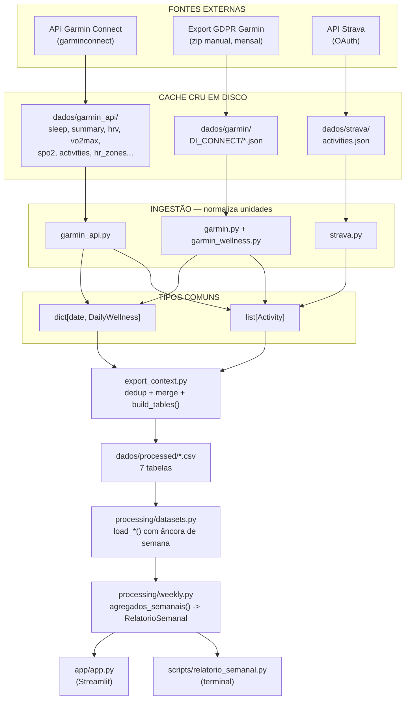

# Relatório semanal — decisões, pipeline e tecnologias

Documento de referência sobre a camada de relatório: por que ela existe separada
dos notebooks, que decisões moldaram o formato, qual a sequência exata de
execução e o que o Streamlit usa para renderizar.

---

## 1. O problema que o relatório resolve

Os quatro notebooks (`00_overview`, `01_wellness`, `02_activities`,
`03_load_recovery`) respondem **"como está a série ao longo do tempo"**. São
laboratório: você abre, filtra, testa uma hipótese, calibra um limiar olhando o
gráfico inteiro.

O relatório semanal responde outra coisa: **"como foi esta semana em relação às
últimas"**. É pergunta diferente e por isso caminho de código diferente.

A distinção não é cosmética. Ela determina o formato do dado:

| | Notebook | Relatório |
|---|---|---|
| Unidade de análise | A série inteira | Uma semana |
| Número isolado serve? | Sim, no eixo do gráfico | Não — sem comparação não diz nada |
| Quem lê | Você, explorando | Você, decidindo o treino da semana |
| Frequência | Quando dá vontade | Toda segunda |

É daí que nasce a decisão estruturante: **no relatório, todo número vem em par**
— o valor da semana e a linha de base. Um "14,4 km" sozinho é inútil; "14,4 km,
+8% sobre a base de 13,3 km" é uma informação.

---

## 2. Pipeline completa



O ponto que sustenta a arquitetura: **as três ingestões produzem os mesmos dois
tipos**. `metrics`, `build_tables`, os CSVs, os notebooks e o app não sabem — nem
precisam saber — se um dia veio da API ou do zip do GDPR.

### Por que o cache cru existe

`sync()` grava a resposta da API **como veio**, antes de qualquer interpretação.
Isso paga em três situações concretas:

1. **Corrigir o parser não exige rebaixar nada.** Se descobrirmos que o campo de
   HRV mudou de nome, arruma-se a função e reprocessa o disco.
2. **Rodar notebook nunca toca a rede.** Análise é reprodutível e offline.
3. **A biblioteca é não-oficial e vai quebrar.** Quando quebrar, todo dia já
   baixado continua seu.

---

## 3. As três sequências de execução

### Sequência A — atualização semanal (o agendador)

Disparada pelo Agendador de Tarefas do Windows. **Zero interação.**

```
python scripts/atualizar.py
│
├─ 1. subprocesso: garmin_sync.py --silencioso
│     ├─ _obter_cliente()      retoma a sessão de dados/.garmin_tokens
│     ├─ sync()                wellness: 5 endpoints × dias que faltam
│     │                        + 2 caudas de rebusca (ver §4.9)
│     └─ sync_activities()     lista do período (1 chamada)
│                              + 3 blocos de detalhe por atividade nova
│
├─ 2. subprocesso: export_context.py
│     ├─ _carregar_atividades_garmin()   API + export GDPR, dedup por activityId
│     ├─ StravaIngestion.load_export_json()
│     ├─ _merge_garmin_into_strava()     casa por horário ±10min e distância ±200m
│     ├─ _carregar_wellness()            API + export, merge por data
│     └─ build_tables()                  reescreve os 7 CSVs
│
└─ 3. processing/estado.registrar()
      grava dados/.ultima_execucao.json com o resultado de cada etapa
```

Três decisões nesta sequência:

- **Cada etapa em subprocesso próprio.** Uma falhar não derruba a outra nem
  impede o registro. E a saída de cada uma vai inteira para o log.
- **Usa `sys.executable`.** No agendador não existe venv ativado; chamar
  `"python"` pegaria o interpretador do sistema, sem as dependências.
- **Reprocessa mesmo se o sync falhou.** O que já está em cache continua válido,
  e CSV reconstruído de dado antigo é melhor que CSV nenhum.

### Sequência B — leitura no app

```
streamlit run app/app.py
│
├─ 1. estado.resumo()          banner de frescor, ANTES de qualquer número
├─ 2. barra lateral            semana, base, incluir semana em curso
├─ 3. carregar_relatorio()     @st.cache_data(ttl=300)
│     └─ weekly.relatorio_semana()
│           ├─ agregados_semanais()      todas as semanas de uma vez
│           │     ├─ load_activities()   volume
│           │     ├─ load_hr_zones()     intensidade
│           │     ├─ load_training_load() carga
│           │     └─ load_wellness()     recuperação
│           ├─ seleciona a linha da semana + as N anteriores com treino
│           ├─ monta as Comparacao
│           └─ _observacoes()            aplica os limiares
└─ 4. renderiza                observações -> volume -> intensidade -> carga -> recuperação
```

### Sequência C — leitura no terminal

```
python scripts/relatorio_semanal.py
└─ weekly.relatorio_semana()   # exatamente a mesma chamada da sequência B
   └─ weekly.formatar_relatorio()
```

**As sequências B e C compartilham tudo menos a última linha.** É o que garante
que o app e o terminal nunca discordem.

---

## 4. Decisões do relatório

### 4.1 Toda métrica é um par, não um número

`Comparacao` é uma dataclass com `valor`, `base`, `unidade`, e os deltas
calculados por `@property`.

**Alternativa rejeitada:** cada métrica como float solto, com a comparação feita
na renderização. Isso espalharia a mesma conta pelo app e pelo terminal, e a
comparação — que é a razão de o relatório existir — viraria detalhe opcional que
alguém esquece de fazer.

### 4.2 Devolve dado, não texto nem gráfico

`relatorio_semana()` retorna `RelatorioSemanal`, uma dataclass.
`formatar_relatorio()` é **uma** das apresentações; o Streamlit é outra.

**Alternativa rejeitada:** montar o relatório dentro da página do Streamlit. A
lógica ficaria presa lá, o terminal precisaria de uma segunda implementação, e as
duas divergiriam no primeiro ajuste.

### 4.3 Calcula todas as semanas de uma vez

`agregados_semanais()` produz uma linha por semana com todas as métricas; o
relatório é seleção de linha.

**Por quê:** além de mais simples que recalcular a agregação para a semana e para
cada semana da base, **garante que semana e base são medidas exatamente do mesmo
jeito**. Duas funções separadas divergiriam com o tempo.

### 4.4 As quatro fontes entram separadas, não pela interseção

Usa `load_training_load()` e `load_wellness()` independentes, não `load_daily()`
(que é o merge dos dois).

**Por quê:** `load_daily()` é um `inner join` — só dias com wellness *e* carga.
Usá-lo reduziria a série toda à janela mais curta (hoje, 147 dias de wellness
contra 366 de carga). Separadas, uma semana com treino mas sem wellness ainda
rende o bloco de carga completo, com os campos de recuperação vazios.

### 4.5 Base = 4 semanas anteriores **com treino**

Semana sem treino é pulada, não entra como zero.

**Por quê:** uma semana de férias no meio da base derrubaria a média e faria a
semana seguinte parecer salto de carga — disparando um alerta falso justamente
quando o atleta voltou ao normal.

### 4.6 Padrão é a última semana completa

A semana em curso só entra com `parcial=True`, e aí `completa=False` para a
interface avisar.

**Por quê:** se hoje é quarta, a semana tem dois dias. Comparar dois dias contra
médias de sete produz um relatório que mente sem avisar — todo indicador de
volume aparece despencando.

### 4.7 Zero e ausência são coisas diferentes

Semana com treino e sem corrida tem `km_corrida = 0.0`. Semana sem registro
nenhum tem `None`, que a interface mostra como "sem dado".

**Como apareceu:** na semana 119 o atleta fez 2 sessões de musculação e nenhuma
corrida. O `groupby` devolvia `NaN`, que seria exibido como "sem dado" — mas ele
correu zero, o dado existe. São leituras opostas.

### 4.8 Percentual compara em pontos percentuais

Métrica cuja unidade é `%` mostra `+5,3 pp`, não `+134%`.

**Por quê:** "Z4+Z5 saiu de 3,9% para 9,2%" é `+134%` aritmeticamente correto e
ilegível. Ponto percentual é o que um treinador lê sem traduzir.

### 4.9 Duas caudas de rebusca (herdado do sync, afeta o relatório)

Dias já em cache são pulados, **exceto** os últimos `DIAS_REBUSCA` do intervalo
pedido *e* os últimos que já estão em cache.

**Por quê a segunda cauda:** o Garmin revisa score de sono e HRV depois do fato.
No ritmo semanal, os dias gravados ainda provisórios na rodada anterior já
estariam velhos demais para a primeira cauda e nunca seriam revisitados —
congelando valores provisórios na série para sempre.

### 4.10 "Nada a apontar" ≠ "nada para avaliar"

Quando falta a carga ou o wellness da semana, existe observação própria dizendo
isso.

**Como apareceu:** a semana 60 (anterior ao relógio) tem só volume e saía com
`[ok] Semana sem apontamentos` — como se fosse uma boa semana, quando na verdade
não foi avaliada.

### 4.11 Frescor antes de qualquer número

O banner de `processing.estado` é a primeira coisa da página.

**Por quê:** tarefa agendada falha em silêncio. O token expira, nada roda, e o
app segue mostrando os números da semana passada com a mesma confiança. Isso é
pior que não ter app — a decisão de treino sai errada sem ninguém desconfiar. E
o resumo nunca diz "tudo bem" por omissão: **nunca-rodou**, **falhou** e
**velho demais** são três estados distintos e os três aparecem.

---

## 5. Os limiares

Ficam nomeados no topo de `weekly.py` porque são **julgamento, não fato**. Cada
observação cita o limiar que a disparou, para poder ser contestada sem caçar
número no meio do código.

| Constante | Valor | Dispara | Observação |
|---|---|---|---|
| `META_BAIXA_INTENSIDADE` | 80% | Z1+Z2 abaixo disso | atenção |
| `LIMITE_GRAY_ZONE` | 30% | Z3 acima disso | atenção |
| `SALTO_VOLUME_PCT` | 30% | km acima da base + 30% | **alerta** |
| `QUEDA_HRV_PCT` | 7% | HRV abaixo da base | **alerta** |
| `TSB_FADIGA` | −20 | TSB abaixo | **alerta** |
| `TSB_DESTREINO` | +20 | TSB acima | atenção |
| `SONO_MINIMO_HORAS` | 7 h | média semanal abaixo | atenção |
| `BASELINE_SEMANAS` | 4 | — | tamanho da linha de base |

Dois merecem discussão explícita:

- **`SALTO_VOLUME_PCT = 30`** e não a regra clássica dos 10%. A regra dos 10% é
  conservadora demais para quem está construindo base a partir de volume baixo,
  onde +10% são 1,3 km.
- **`QUEDA_HRV_PCT = 7`** é relativo à própria base, não a um valor absoluto.
  Não existe "HRV bom" universal: depende de idade, método de medição e
  indivíduo. O que informa é o desvio contra as semanas recentes do mesmo atleta.

---

## 6. Tecnologias no Streamlit

### Stack

| Camada | Ferramenta | Versão | Papel |
|---|---|---|---|
| Runtime | Python | 3.13.1 | — |
| Interface | Streamlit | 1.63.0 | servidor, estado, componentes |
| Gráficos | Altair (via Vega-Lite) | 6.2.2 | motor por trás de `st.*_chart` |
| Dados | pandas | 3.0.3 | agregação semanal |
| Ingestão | garminconnect | 0.3.11 | cliente não-oficial do Connect |

Declaradas no extra `app` do `pyproject.toml`, separado de `notebooks`: o app não
precisa de matplotlib nem de kernel Jupyter.

```
pip install -e "./athlete-coach[app]"
```

### Estrutura multipage

Streamlit monta a navegação a partir do sistema de arquivos:

```
app/
├── app.py                 # entrypoint — vira a primeira página
└── pages/
    └── 1_Historico.py     # o prefixo numérico ordena a barra lateral
```

Sem roteador, sem configuração. `streamlit run app/app.py` acha o resto sozinho.

### Componentes usados e por quê

| Componente | Onde | Por que este |
|---|---|---|
| `st.set_page_config(layout="wide")` | topo das duas páginas | as métricas ficam em 4 colunas; layout estreito quebraria em duas linhas |
| `st.success` / `st.warning` / `st.error` | banner de frescor e observações | a cor **é** o nível de severidade — o mesmo dicionário mapeia `alerta/atencao/ok` para a função |
| `st.metric` | 14 métricas | traz valor + delta + seta nativamente, que é exatamente a forma da `Comparacao` |
| `delta_color="inverse"` | FC de repouso, gray zone | **crítico**: sem isso o app pinta de verde uma piora |
| `st.columns` | blocos de métrica | agrupa visualmente o que é do mesmo assunto |
| `st.cache_data(ttl=300)` | carregadores | trocar de semana não relê os CSVs; TTL de 5 min faz uma atualização do pipeline aparecer sem reiniciar |
| `st.toggle` / `st.selectbox` / `st.slider` | barra lateral | semana em curso, qual semana, tamanho da base |
| `st.area_chart` | intensidade por semana | empilha as três faixas nativamente, com cores passadas em `color=` |
| `st.bar_chart` | volume semanal | barra é a forma certa para quantidade discreta por período |
| `st.line_chart` | CTL/ATL/TSB, HRV, sono | linha é a forma certa para estado contínuo |
| `st.expander` | versão em texto, tabela completa | esconde o detalhe sem esconder que ele existe |
| `st.code` | relatório em texto | monoespaçado preserva o alinhamento das colunas |
| `st.caption` | sob cada subtítulo | onde mora a explicação de como ler o bloco |

### Estratégia de cache

```python
@st.cache_data(ttl=300)
def carregar_relatorio(semana, baseline, parcial):
    return relatorio_semana(semana=semana, baseline=baseline, parcial=parcial)
```

`st.cache_data` serializa o retorno, então o valor precisa ser picklable —
`RelatorioSemanal` é uma dataclass simples e passa. A chave do cache são os
argumentos, então cada combinação de (semana, base, parcial) é memorizada
separadamente: navegar entre semanas fica instantâneo depois da primeira visita.

O `ttl=300` é o que faz a atualização do agendador aparecer sozinha. Sem TTL, o
app mostraria dado velho até ser reiniciado — recriando exatamente o problema que
o banner de frescor existe para evitar.

### Como o app é testado

`streamlit run` sobe o servidor, mas **não prova que o código Python roda**: a
página é uma SPA, o script executa depois na conexão websocket, e o servidor
devolve HTTP 200 mesmo com o script quebrado.

O que verifica de verdade é o `AppTest`, que executa o script no processo de
teste e captura exceções:

```python
from streamlit.testing.v1 import AppTest

at = AppTest.from_file("app/app.py", default_timeout=120).run()
assert not at.exception
assert at.title[0].value.startswith("Semana")
print([(m.label, m.value, m.delta) for m in at.metric])
```

Ele também dá acesso aos widgets renderizados, então dá para afirmar sobre o
conteúdo — que as 14 métricas existem, que o delta de percentual sai em `pp`.

---

## 7. Como acrescentar uma observação

Esta é a parte que determina se o projeto envelhece bem.

**O fluxo certo:**

1. **Notebook** — investigue se a observação se sustenta. É laboratório: teste se
   o padrão aparece na série, calibre o limiar olhando os dados.
2. **`weekly.py`** — quando a observação provar valor, ela vira código:
   - o limiar entra como constante nomeada no topo;
   - a regra entra em `_observacoes()`, citando o limiar na mensagem;
   - se precisar de uma métrica nova, ela entra em `agregados_semanais()` e no
     `RelatorioSemanal`.
3. **Nada mais.** Ela aparece no terminal e no app de graça.

**O fluxo errado**, que parece natural e não é: escrever a observação num
notebook e depois "exportar para o Streamlit". Isso duplica a lógica em dois
lugares que divergem no primeiro ajuste, e nenhum dos dois é obviamente o certo.

O notebook descobre; o `weekly.py` decide; a tela mostra.

---

## 8. Limites conhecidos

- **`relatorio_semana()` recalcula todas as semanas** a cada chamada. Hoje são 89
  linhas de agregação (69 semanas com treino, numeradas de 1 a 119) e o custo é
  imperceptível; se a série crescer muito, `agregados_semanais()` é o ponto
  natural para cachear em disco.
- **A biblioteca do Garmin é não-oficial.** O ponto de conserto está isolado em
  `ENDPOINTS`, `ENDPOINTS_ATIVIDADE` e `_obter_cliente()`.
- **O token expira.** Quando expirar, a tarefa agendada falha e o app marca os
  dados como velhos — mas a renovação exige uma execução manual no terminal,
  porque o login pode pedir MFA.
- **O app roda local.** Publicar num host público exporia sono, HRV e FC de
  repouso.
- **Os limiares não foram validados contra este atleta.** Vêm da literatura. A
  série de observações ao longo dos meses é o que vai dizer se `QUEDA_HRV_PCT`
  deveria ser 5% ou 10% para ele.
